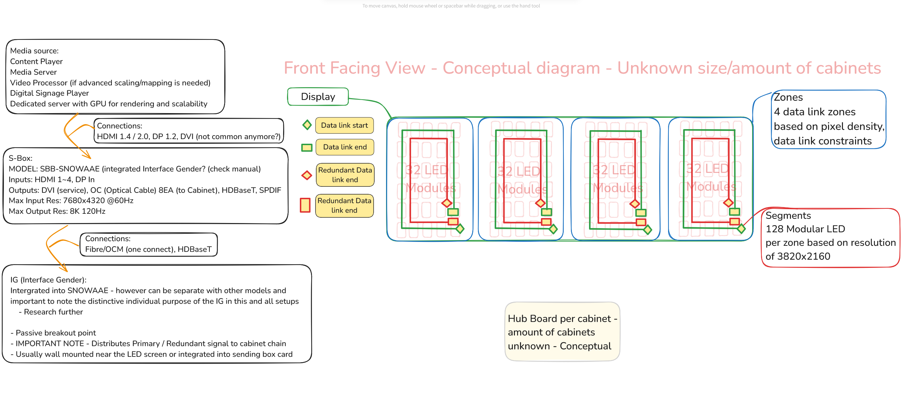

# Installation & system understanding Study material

## About This Repository

This repository is simply a place for me to collect notes, diagrams, terminology, and general research while learning and researching theoretical large display LED installation. Particularly large format Samsung systems.

I’m very new to this field. This isn’t intended to be a definitive guide or reference for others, but more of a personal learning project. If anything here is useful that's great but first and foremost, this is a workspace for me to structure my thoughts and document what I’m picking up as I go.

The goal of this is not to act like theoretical knowledge is any replacement for real on site implicit learning and experience. I understand installing and working with LED systems properly is a hands on skillset built through practical exposure, potencial mistakes, and working alongside experienced engineers and technicians.

This project exists to fill the gap while I build that experience and to give myself something to refer back to, to stay organised, and to show future employers that I’m taking the learning process seriously while staying aware of my current limitations.

Please expect mistakes and many revisions.

## Contents

| Section | Description |
|---------|-------------|
| [Raw Notes](./reflections.md) | Direct thoughts, notes and reflections on findings. |
| [System Architecture](./system-architecture.md) | High-level breakdown of how LED walls are structured from source to display. Signal flow and core components. |
| [Cabling Principles](./02_cabling-principles.md) | Notes on cable types, data transmission methods, redundancy, and physical install considerations. |
| [Samsung-Specific Details](./04_samsung-specifics.md) | Notes on Samsung’s S-Box, Interface Gender (IG), OCM cables, and cabinet connection standards. |
| [On-Site Etiquette](./05_on-site-etiquette.md) | Notes for working clean, communicating well, asking for help properly, and behaving on a job site. |
| [Glossary](./06_glossary.md) | Quick reference for AV and LED-specific terminology. |

## System Architecture — Conceptual Overview

Direct view of diagram https://excalidraw.com/#json=NPLsQsz8ElgyF7sBgBLDe,4wMioGRf5puwPQk9xx8VHg

This diagram represents a theoretical LED wall system layout for learning and reference purposes.

It represents my current understanding of the core signal flow from Media Source → S-Box Processor → IG (Interface Gender) → Data Zones → Cabinets → LED Modules.

The diagram assumes an unknown display size and cabinet count and trying to focus instead on the fundamental system architecture and data link principles.

---

### Remaining Work:
- Add cabinet-to-cabinet data link details within each zone.
- Add power chain routing between cabinets.
- Confirm data link cable types used (IG → Cabinet, Cabinet → Cabinet).
- Confirm IG output limits and behaviour per model.

---

Raw research notes unedited: [reflections.md](./reflections.md)

## Usage Notes

This is a personal learning repository. Files are organised into topic-specific markdown files. Images and diagrams will be stored in the `/assets` directory. Content will evolve over time as I learn more or correct mistakes.

## Resources & References

- Samsung LED Display Installation Manuals  
  https://eu.community.samsung.com/t5/led-displays/iwa-ifa-installation-manual/ta-p/10612892

- Manufacturer Documentation

- Samsung LED Video Wall Training Videos  
  https://www.youtube.com/playlist?list=PL51xQIiUs4fn57tMAuRTE90B15xAdUGtR

- Technical Forums & Industry Resources  
  https://www.daktronics.com/en-us/support/training  
  https://www.daktronics.com/en-us/learning-and-resources/led-learning-center

Manuals:

https://eu.community.samsung.com/t5/led-displays/iwa-ifa-installation-manual/ta-p/10612892
https://www.manualslib.com/manual/1334079/Samsung-Snow-1703u.html?page=16#manual
https://www.manualslib.com/manual/2916629/Samsung-Iwa-Series.html?page=36#manual

Configurators:

https://display-configurator.biz.samsung.com/
https://partner.daktronics.com/design-tools/indoor-led-video-wall-configurator?e=other&w=15.000&h=6.000&u=metric&r=8k&s=1.2&m=5111
https://dynamo-led-displays.co.uk/novastar-led-processor-calculator/?utm_source=chatgpt.com
https://www.dgicommunications.com/led-calculator/?utm_source=chatgpt.com

